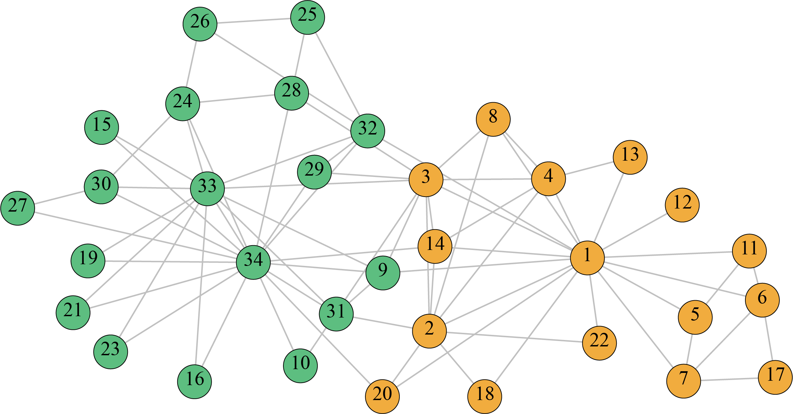
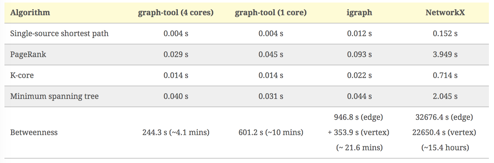

---
jupyter:
  jupytext:
    text_representation:
      extension: .Rmd
      format_name: rmarkdown
      format_version: '1.2'
      jupytext_version: 1.19.1
  kernelspec:
    display_name: Python 3 (ipykernel)
    language: python
    name: python3
---

```{r setup, include=FALSE}
library(reticulate)
use_python("/Users/Zhuanz/anaconda3/bin/python3.11", required = TRUE)
# or use your conda environment
use_condaenv("base", required = TRUE)
```

<!-- #region -->

The karate club network is a classic social network. In the early 1970s, American sociologist Zachary spent two years observing the social relations between 34 members of the karate club in an American university.

Based on the internal and external interaction of club members, he constructed a network of relationships between members. The network contains 34 nodes, each of which represents a member. If the two members are at least friends with frequent interaction, there is an edge between the corresponding nodes. Due to the dispute between the club coach (node 1) and the supervisor (node 34), it was divided into two small clubs with each as the core, and the members of the small club were represented by yellow nodes and green nodes respectively. The network contains two real communities, and many researchers use it to test the effectiveness of community discovery algorithms.



The karate club network data set can be downloaded through this link, but most python diagram analysis toolkits themselves contain the data set or can call the method in the package to download directly from the remote link.

This case first introduces the currently popular python diagram analysis toolkit, and then selects the igraph toolkit to analyse the karate club network. The analysis process includes three parts: construction diagram, node centre analysis and community discovery. You can refer to the article for the comparison of the rest of the network analysis software and toolkit.

### 0 package version information

Check the version of the package by executing the shell command in the notebook.

```{python}
# !pip freeze | grep python-igraph
```

### 1 Introduction to Python Chart Analysis Toolkit

The more popular python graph analysis toolkits include igraph, NetworkX and graph-tool. NetworkX is a pure python implementation, while igraph is implemented in C, which can be called in Python and R, so igraph is better than NetworkX in terms of time consumption.

The following figure shows the performance comparison of several representative algorithms realised by three libraries on the same chart (a total of 39,796 nodes and 301,498 edges):



### 2 Build a karate club chart

```{python}
from igraph import *
import matplotlib.pyplot as plt
import seaborn as sns
import numpy as np
import pandas as pd
# %matplotlib inline
```

Igraph provides Nexus to remotely obtain commonly used networks for analysis. For example, Nexus.get("karate") can directly obtain the map of the karate club, but because the remote domain name http://nexus.igraph.org/ cannot be parsed normally now, we choose to go directly to the UCL network data set to download the network files of the karate club.

### 2.1 Read the gml file

Igraph can read network data files in a variety of formats, such as net, gml, graphml and pajek. Here, we call Read_GML to read network data and store it as a Graph object, and all subsequent analyses need to call this object.

```{python}
karate = Graph.Read_GML('数据集/karate.gml')
```

### 2.2 Draw and render the karate club diagram¶

We can use the `summary()` and `plot()` functions to observe the basic information of the karate club network and draw its network diagram respectively.

```{python}
print (summary(karate))

# Use the dictionary visual_style to set some layouts of graphics
layout = karate.layout('kk') # Use the common Kamada-Kawai layout
visual_style = {}
visual_style["edge_color"] = "gray" # Set the colour of the edge
visual_style["vertex_size"] = 20 # Node size setting
visual_style["vertex_color"] = 'rgb(218.89, 232.93, 245.96)'# Node colour setting
visual_style["layout"] = layout # Set the layout template
visual_style["bbox"] = (300, 300) # Set the size
visual_style["margin"] = 20 # Set the distance of the graphic from the edge
visual_style["edge_curved"] = False # Specify the side to be curved or straight
plot(karate, **visual_style)
```

The network contains 34 nodes and 78 edges, and the data file contains the id attribute, representing the id information of each node. And it is an undirectional network diagram. Next, we use the id information in the node to mark it on the node in the figure. We add a new attribute label through karate.vs to mark the node. This new attribute is actually the same as id. The plot() function will automatically mark the node according to the label when drawing.

```{python}
# Convert id to int type
karate.vs['label'] = [int(item) for item in karate.vs['id']] 
plot(karate, **visual_style)
```

### 3 Centrality analysis

When using igraph, we need to remember that the operation of nodes needs to be combined with the karate.vs() function, in which "vs" is the abbreviation of "vertexs", which means vertex in Chinese, which means the same as the node we often say. For the operation of edges, it needs to be combined with the karate.es() function, in which "es" is the abrefiation of "edges", that is, the meaning of edge, which is easy to understand.

Next, we will calculate the centre value of each node, mark each node with colours from light to dark, and the darker the colour, the greater the centre value.

### 3.1 Calculate the value of the centre degree

First, calculate the values of degree centre degree, intermediate centre degree, tight centre degree and characteristic vector centre degree.

```{python}
degree_cent = karate.degree() # Degree centre degree
between_cent = karate.betweenness() # Intermediate centre degree
closeness_cent = karate.closeness() #Tight centre degree
eigen_cent = karate.eigenvector_centrality() # Characteristic vector centre degree
```

In order to make the shade of the colour draw the relative size relationship of the centre between the nodes, we use the following ideas to draw:

- Make colour_num different colour schemes, and for the same colour from light to dark

- Use isodistance scattering to divide the centre degree value into colour_num interval bins

- Match the centre degree of each node with the interval to which it belongs, and assign a subordinate mark to each node vs_belongs.

- The interval bins corresponds to colours one by one, and the corresponding colour is drawn according to the interval to which the node belongs.

### 3.2 Make colour_num gradient colour scheme

First of all, our colour scheme is 10 blues from light to dark.

```{python}
vsnumber = karate.vcount() # Number of network nodes
color_num = 20
sns.palplot(sns.color_palette("Blues",color_num))
colors = [x for x in sns.color_palette("Blues",color_num)]
```

Next, define the function of drawing different node colours according to the value of the centre degree (in order to repeat the network diagram under the condition of four degrees of centre degree). This paragraph is difficult to understand, please be patient:

```{python}
def colors_by_centrality(centrality):
    """
    Input: centrality, a list of centrality values

    Output: karate.vs["colours"], a list of colour values corresponding to each node
    """
    centrality_df = pd.DataFrame(centrality, index=range(1,vsnumber+1), columns=['centrality'])
    bound_low = min(centrality_df['centrality'])
    bound_high = max(centrality_df['centrality'])

    # Get the interval of colour_num
    bins = list(np.linspace(bound_low, bound_high, color_num+1))
    bins[-1] = bound_high+0.001 # Ensure that the maximum value is within the last interval.
    bins[0] = bound_low-0.001 # Ensure that 0 is within the first interval

    # The interval corresponding to each node is marked with (0,...,9)
    vs_belongs = pd.cut(centrality_df['centrality'],bins, labels= range(0,color_num))

    # Set the colour attributes of each node
    for vertex in karate.vs():
        vs_belong = vs_belongs.iloc[vertex.index]
        rgb_code = tuple(map(lambda x:x*255, colors[vs_belong])) #Convert the colour percentage to the RGB value of 0-255
        vertex["colors"] = 'rgb'+str(rgb_code)
    return karate.vs["colors"]
```

### 3.3 Centrality analysis

```{python}
# Degree centre degree
visual_style["vertex_color"] = colors_by_centrality(degree_cent)
plot(karate,**visual_style)
```

```{python}
# Intermediate centre degree
visual_style["vertex_color"] = colors_by_centrality(between_cent)
plot(karate,**visual_style)
```

```{python}
# Tight centre degree
visual_style["vertex_color"] = colors_by_centrality(closeness_cent)
plot(karate,**visual_style)
```

```{python}
# Characteristic vector centre degree
visual_style["vertex_color"] = colors_by_centrality(eigen_cent)
plot(karate,**visual_style)
```

For the four central measurement methods, the centrality values of node 1 and node 34 are larger than other nodes. Recalling the network origin explained at the beginning of the case, it is found that this is consistent with the actual situation.

### 4 Community discovery

Finally, we use different community discovery algorithms for community discovery. Igraph provides many community discovery algorithms. Here we use the GN algorithm community_edge_betweeness() based on the edge intermedia number and the Newman fast algorithm community_fas, which is modularly optimised based on the greedy pattern. Tgreedy(). The Newman fast algorithm cannot specify how many communities are finally divided into, while the GN algorithm can set clusters parameters to specify.

### 4.1 Community discovery based on hierarchical clustering and modularity

```{python}
# Run the community discovery algorithm
gn = karate.community_edge_betweenness(clusters=2)
nf = karate.community_fastgreedy()

membership_gn = gn.as_clustering().membership
membership_nf = nf.as_clustering().membership
```

In this way, we can label each node with a subordinate community.

It is better to use seaborn to specify three beautiful rendering colours first. Here, three beautiful colours are selected from seaborn's xkcd colour scheme. If you often draw with seaborn, it is recommended to bookmark this website, which will be used very frequently.

```{python}
colors_cd = ["powder blue",'eggshell','light sage'] # Cd means community_dectection
sns.palplot(sns.xkcd_palette(colors_cd),size=2)
colors_cd = [x for x in sns.xkcd_palette(colors_cd)] # Convert to an rgb percentage list
```

### GN algorithm community discovery results

```{python}
for vertex in karate.vs():
    color_belong = membership_gn[vertex.index]
    rgb_code = tuple(map(lambda x:x*255, colors_cd[color_belong])) #将颜色百分比转换为0-255的RGB值
    vertex["colors"] = 'rgb'+str(rgb_code)

visual_style["vertex_color"] = karate.vs["colors"]
plot(karate,**visual_style)
```

Compared with the real network, we found that node 3 is divided incorrectly, and it should belong to the community where node 1 is located.

### Newman Rapid Algorithm Community Discovery Results

```{python}
for vertex in karate.vs():
    color_belong = membership_nf[vertex.index]
    rgb_code = tuple(map(lambda x:x*255, colors_cd[color_belong])) #将颜色百分比转换为0-255的RGB值
    vertex["colors"] = 'rgb'+str(rgb_code)

visual_style["vertex_color"] = karate.vs["colors"]
plot(karate,**visual_style)
```

Newman's fast algorithm divides three communities.

### 4.2 Hierarchical Cluster Tree Dendrogram

We can directly use the results of karate.community_edge_betweenness(clusters=2) to draw a hierarchical cluster tree diagram, as shown below.

```{python}
plot(karate.community_edge_betweenness(clusters=2), bbox=[0,0,450,420])
```

