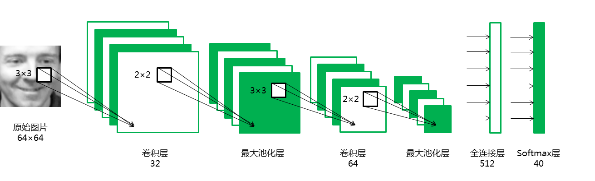

---
jupyter:
  jupytext:
    text_representation:
      extension: .Rmd
      format_name: rmarkdown
      format_version: '1.2'
      jupytext_version: 1.19.1
  kernelspec:
    display_name: Python 3 (ipykernel)
    language: python
    name: python3
---

```{r setup, include=FALSE}
library(reticulate)
use_python("/Users/Zhuanz/anaconda3/bin/python3.11", required = TRUE)
# or use your conda environment
use_condaenv("base", required = TRUE)
```

<!-- #region -->

```{python}
import os
os.environ['CUDA_VISIBLE_DEVICES'] = '7'
```

### 0 Experiment environment

```{python}
# !pip freeze | grep pandas;
# !pip freeze | grep numpy;
# !pip freeze | grep matplotlib;
# !pip freeze | grep seaborn;
# !pip freeze | grep scikit-learn;
# !pip freeze | grep os;
# !pip freeze | grep tqdm;
# !pip freeze | grep keras;
# !pip freeze | grep tensorflow;
```

### 1 Data exploration

Olivetti Faces is a face data set organised by New York University. For specific information, please refer to the official website. The data set includes 400 pictures of 40 people. Each person's 10 face images are collected at different times, light and expressions. The greyscale level of each picture is 8 digits. , the greyscale size of each pixel is between 0-255, and the size of each picture is 64×64.

First, load the Olivetti Faces data set from sklearn's datasets:

```{python}
# %config InlineBackend.figure_format='retina'
import numpy as np
import pandas as pd
import matplotlib.pyplot as plt

# Load the face data set
from sklearn.datasets import fetch_olivetti_faces
faces=fetch_olivetti_faces()
```

Observe the structure and composition of the data set:

```{python}
faces
```

Observation shows that the data set includes four parts:

1) DESCR mainly introduces the source of the data;

2) data stores 400 images in the data set in the form of one-dimensional vectors;

3) images store 400 images in the data set in the form of a two-dimensional matrix;

4) Target stores the category information of 400 images in the data set, representing 40 people in 0-39 respectively.

Let's further observe the structure and types of data:

```{python}
print("The shape of data:",faces.data.shape, "The data type of data:",type(faces.data))
print("The shape of images:",faces.images.shape, "The data type of images:",type(faces.images))
print("The shape of target:",faces.target.shape, "The data type of target:",type(faces.target))
```

All data is stored in the form of numpy.ndarray, which is very convenient to use, because in the next step, we hope to build a convolutional neural network CNN to achieve face recognition, so the features should be stored in two-dimensional matrix images, so that the structural information of the images can be fully exploited.

Next, let's further observe a group of sample images:

```{python}
for i in range(3):
    fig=plt.figure(figsize=(20,5))
    count=1
    if i==0:
        print("This is the first person:")
    if i==1:
        print("This is the second person:")
    if i==2:
        print("This is the third person:")
    for j in range(5):
        ax1=fig.add_subplot(1,5,count)
        count += 1
        plt.imshow(faces.images[10*i+j],cmap="Greys_r")     # Display the picture
        plt.axis('off')                                     # The coordinate axis is not displayed.
    plt.show()    
```

Observations show that there are differences in angles, expressions and light in different images of each person. Although this difference between samples increases the difficulty of classification, it also requires the model to extract the high-order features of the human face, which enhances the generalisation ability of the model.

### 2 Data enhancement

First, divide the training set and the test set:

```{python}
# Define features and labels
x=faces.images
y=faces.target

# Randomly divide the training set and the test set in a ratio of 8:2
from sklearn.model_selection import train_test_split
train_x, test_x, train_y, test_y = train_test_split(x, y, test_size=0.2, random_state=0)

# Record the categories that appear in the test set, and the later model evaluation needs to draw a confusing matrix.
index=set(test_y)
```

Before data enhancement, it is necessary to convert the two-dimensional image into a three-channel image, because the flow function in keras only accepts three-channel image input. General RGB images are accompanied by three primary colour channels: red, green and blue, while greyscale images only have one channel. When greyscale images need to be converted into For three-channel RGB images, you only need to fill all three channels with original greyscale pixels.

In the following loop block, we use the tqdm progress bar library to instantly display the running process of the loop block, which can help us know whether the program is running smoothly, which is very useful for calculating loops with high complexity.

```{python}
import tqdm

# Define the list train_x_RGB to store the converted three-channel image
train_x_RGB=[]

# Use tqdm to output the running process
for k in tqdm.tqdm(range(len(train_x))):
    
    # Define a three-dimensional array to store the converted three-channel image
    image_RGB=np.empty((64,64,3))
    
    # Fill three channels with greyscale pixels
    for i in range(64):
        for j in range(64):
            image_RGB[i][j]=train_x[k][i][j]
    train_x_RGB.append(image_RGB)
train_x_RGB=np.array(train_x_RGB)
```

```{python}
print(train_x_RGB.shape)
```

The dimension of each image has been changed to (64, 64, 3), indicating that it has been successfully converted to a three-channel image.

In deep learning, in order to prevent overfitting, we usually need enough data. When we can't get a sufficient amount of data, we can increase the amount of training data through the geometric transformation of the image. In order to make full use of the limited training set (only 320 samples), we will improve the data through a series of random transformations to prevent over-compilation and improve the generalisation ability of the model.

```{python}
from tensorflow.keras.preprocessing.image import ImageDataGenerator

# Define the categories and degrees of random transformations
datagen = ImageDataGenerator(
        rotation_range=0,            # The angle of random rotation of the image
        width_shift_range=0.01,      # The magnitude of the horizontal offset of the image
        height_shift_range=0.01,     # The magnitude of the vertical offset of the image
        shear_range=0.01,            # Counterclockwise shear transformation angle
        zoom_range=0.01,             # The amplitude of random scaling
        horizontal_flip=True,
        fill_mode='nearest')

for i in tqdm.tqdm(range(len(train_x_RGB))):
    img = train_x_RGB[i]
    img = img.reshape((1,) + img.shape)  # Dimensime conversion
    count = 0
    for batch in datagen.flow(img,batch_size=1,
                        save_to_dir="/Users/Zhuanz/Library/CloudStorage/OneDrive-MaynoothUniversity/R projects/longxiangwu/longxiangwu/_portfolio/2026-03-20-facial/gen",    # The generated image saving path
                        save_prefix=str(train_y[i]),     # After the generated image, it is named with its label, which is convenient to record its type.
                        save_format='png'):
        count += 1
        if count >= 3:                  # Only save the first 3 enlarged images
            break  
```

Read the enhanced training set:

```{python}
import os
import tqdm
import matplotlib.image as mpimg

# Read the training set data
train_x_enhance=[]               
train_y_enhance=[]

fileDir = r"/Users/Zhuanz/Library/CloudStorage/OneDrive-MaynoothUniversity/R projects/longxiangwu/longxiangwu/_portfolio/2026-03-20-facial/gen"                  # 数据所在的文件夹
for root, dirs, files in os.walk(fileDir): 

    for name in tqdm.tqdm(files):
        path=str(root+ '/' + name)           # path
        photo=mpimg.imread(path)             # Read the image
        photo_2D=photo[:,:,0]                # The enhanced image is three-channel, and the slice is read as a two-dimensional matrix.
        train_x_enhance.append(photo_2D)     # Add training set data
        train_y_enhance.append(int(name.split("_")[0])) # Get category information by string cutting

train_x_enhance=np.array(train_x_enhance)
train_y_enhance=np.array(train_y_enhance)  
```

### 3 Establish a convolutional neural network model¶

### 3.1 Define the evaluation function

```{python}
import seaborn as sns
from sklearn import metrics
from sklearn.metrics import classification_report 

"""
The function evaluate(pred,test_y) is used to evaluate the classification results;

Input: real classification, predicted classification results

Output: classification accuracy, confusion matrix, etc.
"""
def evaluate(pred,test_y):
    # Convert three-dimensional classification results into one-dimensional arrays
    pred_1D=[]
    for i in range(len(pred)):
        some=list(pred[i])
        max_index=some.index(max(some))  #Record the index of the maximum value
        pred_1D.append(max_index)
    pred_1D=np.array(pred_1D)
    
    # Convert three-dimensional classification results into one-dimensional arrays
    testy_1D=[]
    for i in range(len(test_y)):
        some=list(test_y[i])
        max_index=some.index(max(some))  #Record the index of the maximum value
        testy_1D.append(max_index)
    testy_1D=np.array(testy_1D)
    
    # The accuracy rate of output classification
    print("Accuracy: %.4f"  % (metrics.accuracy_score(testy_1D,pred_1D)))
    # Output various indicators to measure the classification effect
    print(classification_report(testy_1D, pred_1D)) 
    # More intuitively, we draw a confusion matrix through seaborn.
    # %matplotlib inline
    plt.figure(figsize=(9,6))
    colorMetrics = metrics.confusion_matrix(testy_1D,pred_1D)
    # Coordinate y represents test_y, that is, the real category, and coordinate x represents the estimated category pred
    sns.heatmap(colorMetrics,annot=True,fmt='d',xticklabels=list(index),yticklabels=list(index))
    plt.show()
```

### 3.2 Dimensial conversion

Keras has strict requirements for the format of input data:

1) One-dimensional convolutional layer Conv1D inputs a three-dimensional array, and two-dimensional convolutional layer Conv2D inputs a four-dimensional array;

2) The label must be a one-hot variable.

```{python}
from tensorflow.keras.utils import to_categorical

# Conversion of features: from 3D to 4D
train_x = train_x.reshape(train_x.shape + (1,))
train_x_enhance = train_x_enhance.reshape(train_x_enhance.shape + (1,))
test_x = test_x.reshape(test_x.shape + (1,))

# Conversion of labels: one-hot encoding
train_y = to_categorical(train_y, 40)
train_y_enhance = to_categorical(train_y_enhance, 40)
test_y = to_categorical(test_y, 40)
```

### 3.3 Design network structure

The structure of the convolutional neural network is as follows:


Introduce the required objects from the corresponding modules of keras:

```{python}
from tensorflow.keras.models import Sequential
from tensorflow.keras.layers import Dense, Dropout, Activation, Flatten
from tensorflow.keras.layers import Conv2D, MaxPooling2D
from tensorflow.keras.optimizers import Adam
```

Define the network structure:

```{python}
seed = 100
np.random.seed(seed)

model = Sequential()

# First convolutional layer
model.add(Conv2D(32, (3, 3), padding='valid', input_shape=(64, 64, 1)))
model.add(Activation('relu'))
model.add(MaxPooling2D(pool_size=(2, 2)))

# Second convolutional layer
model.add(Conv2D(64, (3, 3)))
model.add(Activation('relu'))
model.add(MaxPooling2D(pool_size=(2, 2)))

model.add(Dropout(0.25))
model.add(Flatten())

# Fully connected layers
model.add(Dense(512))
model.add(Activation('tanh'))

# Softmax output layer
model.add(Dense(40))
model.add(Activation('softmax'))

model.compile(loss='categorical_crossentropy', optimizer=Adam(), metrics=['accuracy'])
```

### 3.4 Model training and evaluation¶

Train the model with raw data:

```{python}
# Training model
model.fit(train_x, train_y, batch_size=200, epochs=20, validation_data=(test_x, test_y))

# Model evaluation
score = model.evaluate(test_x, test_y, batch_size=20)
print('Test loss:', score[0])
print('Test accuracy:', score[1])
```

More detailed model evaluation:

```{python}
pred=model.predict(test_x)
evaluate(pred,test_y)
```

Using the original data to train the model can achieve an accuracy rate of 90%, among which the most errors are to identify the 17th person as the 22nd person and the 34th person as the 39th person.

Train the model with the enhanced data:

Note: Before retraining the model, the model parameters must be reinitialised, otherwise it will be iterated from the last training result, resulting in errors.

```{python}
# Training model
model.fit(train_x_enhance, train_y_enhance, batch_size=200, epochs=20, validation_data=(test_x, test_y))

# Model evaluation
score = model.evaluate(test_x, test_y, batch_size=20)
print('Test score:', score[0])
print('Test accuracy:', score[1])
```

More detailed model evaluation:

```{python}
pred=model.predict(test_x)
evaluate(pred,test_y)
```

### Results analysis
Draw a bar chart to visually show the differences between the two models:

```{python}
index=["loss","accuracy","precision","recall","f1-score"]
data=np.array([[0.571,0.291],[0.900,0.938],[0.93,0.94],[0.90,0.94],[0.90,0.93]])
df=pd.DataFrame(data,columns=["original","enhance"],index=index)
plt.figure(figsize=(8,6))
df.plot(kind="bar")
plt.ylim([0.2,1])
plt.show()
```

The effect of the data-enhanced model is obviously better than that of the original data model, because the increase of training data can reduce over- fitting. When encountering a data set with a small amount of data, this method should be prioritised.


