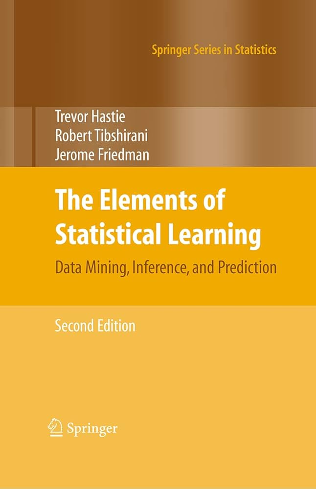
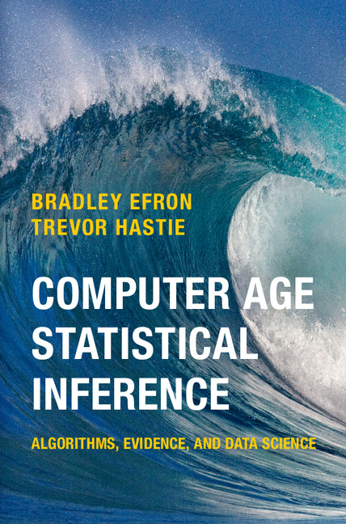
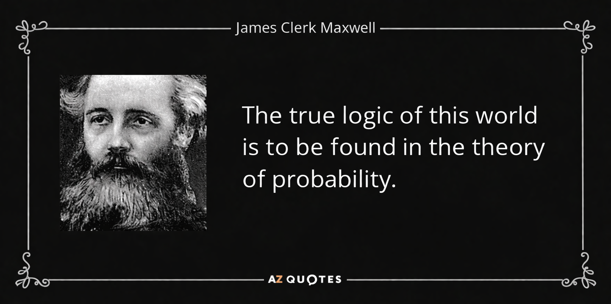

{width=25%} 

## Professional


I have over ten years of experience working with a variety of partners in the technology and industry sectors, and I am a data scientist who is enthusiastic. My responsibilities encompass the entire data pipeline, from exploratory analysis to production-ready predictive models. Notable projects include the development of sales forecasting models for JD.com and the conduct of in-depth logistics data analysis to enhance operational efficiency. I am a member of the Irish Statistical Association.


## Personal

I am currently in a stable and fulfilling stage of life, living with my family and fully committed to both personal growth and professional development. The support and perspective offered by my family environment provide me with balance and inform my work approach, allowing me to operate with patience, care, and a long-term outlook. Beyond my professional interests in data and technology, I place a high value on building meaningful relationships, pursuing continuous learning, and bringing a holistic and authentic perspective to my work. I believe that the most impactful contributions come from individuals who are fully engaged both personally and professionally.


## Contact

Want to chat?  Go ahead, pipe up!  Feel free to contact me on [email](mailto:longxiangwu@outlook.com){target="_blank"}, or [LinkedIn](www.linkedin.com/in/longxiang-wu-003506106){target="_blank"}. I hope to hear from you!

## Books I Am Reading

<center>
:::: {style="display: flex; gap: 10px; align-items: flex-start;"}
::: {style="flex-shrink: 0;"}
{style="height: 300px; width: auto;"}
:::
::: {style="flex-shrink: 0;"}
{style="height: 300px; width: auto;"}
:::
::: {style="flex-shrink: 0;"}
{style="height: 300px; width: auto;"}
:::
::: {style="flex-shrink: 0;"}
{style="height: 300px; width: auto;"}
:::
::::

:::: {style="display: flex; gap: 10px; align-items: flex-start;"}
::: {style="flex-shrink: 0;"}
{style="height: 300px; width: auto;"}
:::
::::
</center>

## Some Quotes
<center>
:::: {style="display: flex; gap: 10px; align-items: flex-start;"}
::: {style="flex-shrink: 0;"}
{style="height: 300px; width: auto;"}
:::
::::

:::: {style="display: flex; gap: 10px; align-items: flex-start;"}
::: {style="flex-shrink: 0;"}
{style="height: 300px; width: auto;"}
:::
::::

:::: {style="display: flex; gap: 10px; align-items: flex-start;"}
::: {style="flex-shrink: 0;"}
{style="height: 300px; width: auto;"}
:::
::::

</center>

## Some Paintings by Claude Monet

<center>
:::: {style="display: flex; gap: 10px; align-items: flex-start;"}
::: {style="flex-shrink: 0;"}
{style="height: 300px; width: auto;"}
:::
::: {style="flex-shrink: 0;"}
{style="height: 300px; width: auto;"}
:::
::::

:::: {style="display: flex; gap: 10px; align-items: flex-start;"}
::: {style="flex-shrink: 0;"}
{style="height: 300px; width: auto;"}
:::
::: {style="flex-shrink: 0;"}
{style="height: 300px; width: auto;"}
:::
::::

:::: {style="display: flex; gap: 10px; align-items: flex-start;"}
::: {style="flex-shrink: 0;"}
{style="height: 300px; width: auto;"}
:::
::: {style="flex-shrink: 0;"}
{style="height: 300px; width: auto;"}
:::
::::

</center>
```{.r .distill-force-highlighting-css}
```
